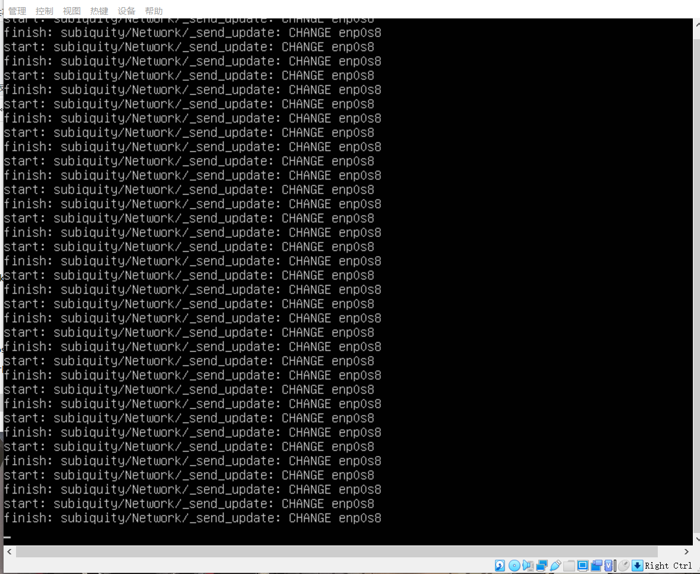

# Linux系统与网络管理第一次实验——Focal Fossa 无人值守安装 iso
## 操作步骤
- 通过链准备好纯净版 Ubuntu 安装镜像 iso 文件（[ubuntu-20.04.2-live-server-amd64.iso](https://releases.ubuntu.com/20.04.2/ubuntu-20.04.2-live-server-amd64.iso) ）
- 通过fork老师的[老师仓库截图](https://github.com/c4pr1c3/LinuxSysAdmin)，下载老师配置好的 user-data 、meta-data 和 autoinstall-user-data 文件（在 /exp/chap0x01/cd-rom/nocloud 目录下）
- 新建可以用于安装 Ubuntu 64位系统 的虚拟机配置 
- 直接使用老师制作好的 focal-init.iso 文件（也在 /exp/chap0x01/cd-rom/nocloud 目录下）
- 移除上述虚拟机「设置」-「存储」-「控制器：IDE」并在「控制器：SATA」下新建 2 个虚拟光盘，按顺序 先挂载「纯净版 Ubuntu 安装镜像文件」后挂载 focal-init.iso 
- 启动虚拟机,出现以下提示信息并输入yes
- 漫长的等待
- 安装完成
- SSH成功连接

## 实验问题&解决方案

- 虽然无人值守安装成功但是在此处停留时间过久（全程联网）
- 目前除了等待没有最佳解决方案

### 关于如何使用sftp在虚拟机和宿主机之间传输文件

参考文献

- [利用 sftp 在本地和服务器之间传输文件](https://blog.csdn.net/gzxdale/article/details/81140889)