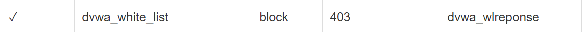

# 实验五实验报告
## 实验环境
- Windows10
- ubuntu 20.04.02 LST
- VirtualBox 6.1
- VScode 1.56.2
- GitHub Desktop 2.8.1

## 环境配置
### Windows Host文件
```bash
192.168.90.102 vn.sec.cuc.edu.cn
192.168.90.102 dvwa.sec.cuc.edu.cn
192.168.90.102 wp.sec.cuc.edu.cn
```

### Linux 相关软件安装
#### Nginx
```bash
sudo apt install nginx
```
#### VeryNginx
1. 下载VeryNginx的zip，解压后传入linux。
2. 运行`sudo python3 install.py install`
3. 根据报错安装相关依赖`sudo apt-get install python3 libpcre3-dev libssl1.0-dev zlib1g-dev build-essential`
4. 修改 `/opt/verynginx/openresty/nginx/conf/nginx.conf` 配置文件,将user从nginx修改为www-data,修改server监听端口为8080。
5. 添加Nginx进程的权限`chmod -R 777 /opt/verynginx/verynginx/configs`
6. 在主机访问8080端口发现可以访问Nginx初始页面。
7. 启动verynginx，通过浏览器对verynginx进行配置，在浏览器中访问`http://vn.sec.cuc.edu.cn:8080/verynginx/index.html`，默认用户名和密码是 `verynginx`和`verynginx`。登录后就可以进行相关配置。

#### Wordpress
1. 下载wordpress4.7.zip，解压后传入linux。
2. 将解压后的wordpress移到指定路径  
   `sudo mkdir /var/www/html/wp.sec.cuc.edu.cn`  
   `sudo cp wordpress /var/www/html/wp.sec.cuc.edu.cn`
3. 下载安装mysql数据库`sudo apt install mysql-server`
4. 登录mysql `sudo mysql`
5. 新建一个数据库wordpress`CREATE DATABASE wordpress DEFAULT CHARACTER SET utf8 COLLATE utf8_unicode_ci;`
6. 新建一个用户`GRANT ALL ON wordpress.* TO 'wordpressuser'@'localhost' IDENTIFIED BY 'password';`
7. 安装相关依赖`sudo apt install php-curl php-gd php-intl php-mbstring php-soap php-xml php-xmlrpc php-zip`
8. 重启`sudo systemctl restart php7.2-fpm`
9. 修改nginx配置`sudo vim /etc/nginx/sites-enabled/default`
10. 将网站根站点修改为wordpress的安装目录`root /var/www/html/wp.sec.cuc.edu.cn;`
11. 使用`wp.sec.cuc.edu.cn/wordpress/wp-admin/`访问wordpress进行配置，选择语言，然后连接数据库，设置完wordpress用户名密码即可访问wordpress网站。  
      
    
12. 配置PHP-FPM进程的反向代理
    - 创建新服务器块配置文件`/etc/nginx/sites-available/wp.sec.cuc.edu.cn`
    ```bash
        server {
          listen 80 default_server;
          listen [::]:80 default_server;

          root /var/www/html/wp.sec.cuc.edu.cn;
          index index.php index.html index.htm index.nginx-debian.html;
          server_name wp.sec.cuc.edu.cn;

          location / {
              # try_files $uri $uri/ =404;
              try_files $uri $uri/ /index.php$is_args$args;
      
          }

          # 配置PHP-FPM进程的反向代理配置在nginx服务器上    
          location ~ \.php$ {
              include snippets/fastcgi-php.conf;
              fastcgi_pass unix:/var/run/php/php7.2-fpm.sock;
          }

          location ~ /\.ht {
              deny all;
          }
        }
    ```

  - 创建从新服务器块配置文件到/etc/nginx/sites-enabled/目录的符号链接`sudo ln -s /etc/nginx/sites-available/wp.sec.cuc.edu.cn /etc/nginx/sites-enabled/`
  - 取消链接默认配置文件`sudo unlink /etc/nginx/sites-enabled/default`
  - 测试并重启nginx `sudo nginx -t`&`sudo systemctl reload nginx`

#### DVWA
1. 下载DVWA，解压后传入linux。
2. 拷贝至/var/www/html  
    `sudo mkdir /var/www/html/dvwa.sec.cuc.edu.cn`  
    `sudo cp -r /tmp/DVWA/. /var/www/html/dvwa.sec.cuc.edu.cn`  
3. 登录MySQL`sudo mysql`
4. 为dvwa创建MySQL数据库
   ```sql
    CREATE DATABASE dvwa DEFAULT CHARACTER SET utf8 COLLATE utf8_unicode_ci;
    GRANT ALL ON  dvwa.* TO 'dvwauser'@'localhost' IDENTIFIED BY 'p@ssw0rd';
    FLUSH PRIVILEGES;
    exit;
    ```
5. 设置DVWA与PHP等相关环境,重命名  
    `cd /var/www/html/dvwa.sec.cuc.edu.cn/config/`  
    `sudo cp config.inc.php.dist config.inc.php`
6. 修改配置`/var/www/html/DVWA/config/config.inc.php`
```bash
    $_DVWA[ 'db_database' ] = 'dvwa';
    $_DVWA[ 'db_user' ]     = 'dvwauser';
    $_DVWA[ 'db_password' ] = 'p@ssw0rd';
```
7. 修改php配置`/etc/php/7.2/fpm/php.ini`
```bash
    allow_url_include = on
    allow_url_fopen = on
    safe_mode = off
    magic_quotes_gpc = off
    display_errors = off
```
8. 重启php`sudo systemctl restart php7.2-fpm`
9. 将所有权分配给www-data用户和组  
    `sudo chown -R www-data.www-data /var/www/html/dvwa.sec.cuc.edu.cn`
10. 创建新服务器块配置文件`/etc/nginx/sites-available/dvwa.sec.cuc.edu.cn`
```bash
server {
        listen 8080 default_server;
        listen [::]:8080 default_server;

        root /var/www/html/dvwa.sec.cuc.edu.cn;
        index index.php index.html index.htm index.nginx-debian.html;
        server_name dvwa.sec.cuc.edu.cn;

        location / {
            #try_files $uri $uri/ =404;
            try_files $uri $uri/ /index.php$is_args$args;  
        }
  
        location ~ \.php$ {
            include snippets/fastcgi-php.conf;
            fastcgi_pass unix:/var/run/php/php7.2-fpm.sock;
        }

        location ~ /\.ht {
            deny all;
        }
    }
```
11. 创建从新服务器块配置文件到`/etc/nginx/sites-enabled/`目录的符号链接  
    `sudo ln -s /etc/nginx/sites-available/dvwa.sec.cuc.edu.cn /etc/nginx/sites-enabled/`
12. 测试并重启Nginx服务  
    `sudo nginx -t`  
    `sudo systemctl reload nginx`
13. 通过8080端口访问`dvwa.sec.cuc.edu.cn`，生成需要使用的数据库  
    在登录页面输入默认账号密码：  
    User: admin  
    Password: password  
    
## 实验要求
- 在一台主机（虚拟机）上同时配Nginx和VeryNginx

    - VeryNginx作为本次实验的Web App的反向代理服务器和WAF
    - PHP-FPM进程的反向代理配置在nginx服务器上，VeryNginx服务器不直接配置Web站点服务

  - 使用Wordpress搭建的站点对外提供访问的地址为：  http://wp.sec.cuc.edu.cn，
  - 使用 Damn Vulnerable Web Application (DVWA) 搭建的站点对外提供访问的地址为： http://dvwa.sec.cuc.edu.cn。
- 配置`wp.sec.cuc.edu.cn`和`dvwa.sec.cuc.edu.cn`
    - 添加matcher
      
      
    - 添加Up Stream节点以及添加代理通行证
      


### 安全需求
 1. 使用IP地址方式均无法访问上述任意站点，并向访客展示自定义的友好错误提示信息页面
  - 添加matcher

    

  - 添加自定义response

    

  - 添加filter

    

  - 结果:
 
    
2. [Damn Vulnerable Web Application (DVWA)](http://www.dvwa.co.uk/)只允许白名单上的访客来源IP，其他来源的IP访问均向访客展示自定义的友好错误提示信息页面
 - 添加matcher

    

  - 添加自定义response

    

  - 添加filter

    

  - 结果: 禁掉自己IP后，之前正常显示的页面变为下图
 
    
3. 在不升级Wordpress版本的情况下，通过定制[VeryNginx](https://github.com/alexazhou/VeryNginx)的访问控制策略规则，热修复WordPress < 4.7.1 - Username Enumeration
  - 先还原bug
    

  - 添加matcher

    

  - 添加filter

    

  - 结果
    

4. 通过配置[VeryNginx](https://github.com/alexazhou/VeryNginx)的Filter规则实现对[Damn Vulnerable Web Application (DVWA)](http://www.dvwa.co.uk/)的SQL注入实验在低安全等级条件下进行防护
  - 添加matcher

    


  - 添加filter

    

  - 直接返回404,结果

    


5. [VeryNginx](https://github.com/alexazhou/VeryNginx)的Web管理页面仅允许白名单上的访客来源IP，其他来源的IP访问均向访客展示自定义的友好错误提示信息页面
  - 添加matcher

    

  - 添加自定义response

    

  - 添加filter

    

  - 结果:
 
    
6. 通过定制VeryNginx的访问控制策略规则实现：  
   限制DVWA站点的单IP访问速率为每秒请求数 < 50  
   限制Wordpress站点的单IP访问速率为每秒请求数 < 20  
   超过访问频率限制的请求直接返回自定义错误提示信息页面
- 添加自定义response

    

- 添加频率限制Frequency Limit

    

- 结果 
    
      
- 禁止curl访问
  
- 添加matcher
  
    
  
- 添加filter  
    

- 结果  
     
   
## 参考链接
- [2021-linux-public-Zhang1933](https://github.com/CUCCS/2021-linux-public-Zhang1933/blob/ch0x05/ch0x05/ch0x05.md)
- [2021-linux-public-luminous-123](https://github.com/CUCCS/2021-linux-public-luminous-123/blob/chap0x05/chap0x05/chap0x05.md)
- [linux-2020-cuc-Lynn](https://github.com/CUCCS/linux-2020-cuc-Lynn/blob/chap0x05/chap0x05/chap0x05%E5%AE%9E%E9%AA%8C%E6%8A%A5%E5%91%8A.md)
- [linux-2019-jackcily](https://github.com/CUCCS/linux-2019-jackcily/blob/job5/job5/%E5%AE%9E%E9%AA%8C5.md)
- [VeryNginx官方文档](https://github.com/alexazhou/VeryNginx/blob/master/readme_zh.md)
- [大白话之从零讲解 DVWA(壹)-SQL 注入 (SQL Injection) Low Level](https://ld246.com/article/1553218743009)
- [https://www.digitalocean.com/community/tutorials/how-to-install-wordpress-with-lemp-on-ubuntu-20-04](https://www.digitalocean.com/community/tutorials/how-to-install-wordpress-with-lemp-on-ubuntu-20-04)

## 实验问题
- 在检查时发现github不显示图片，经过一系列调整仍不显示，更换浏览器后也不显示。
  
- 但在手机端看时，发现显示正常，怀疑是相关代理问题。